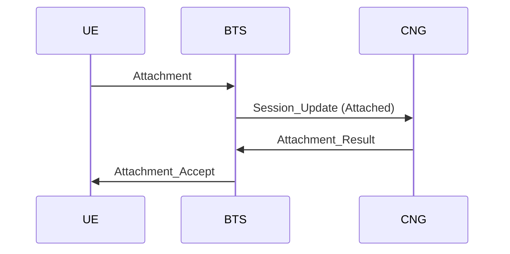
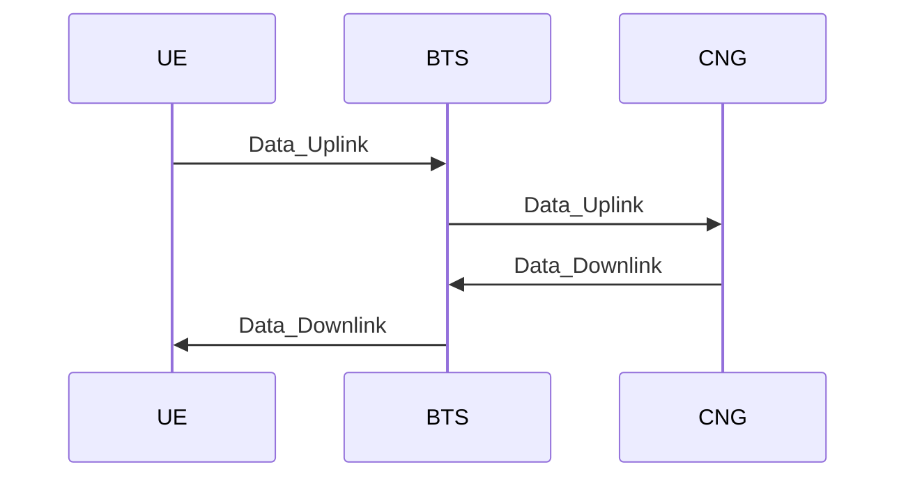

## Part 4: UE Registration Procedure

The registration procedure establishes a UE session with the network. The UE listens for `BTS_Announcement` packets, selects the closest BTS, and attaches to it. Authentication is not part of Layer 1; instead, the CNG returns a verification token that the UE must use to encrypt and protect all later UE-to-BTS packets and Layer 2 data links.

This flow shows the UE registering with the network and receiving the verification token it must use to protect later UE-to-BTS packets and Layer 2 data links.

Explanation:
1. The UE listens for `BTS_Announcement` packets and chooses the closest BTS based on the announced `distance`.
2. The UE sends an unsigned `Attachment` to the selected BTS as the only UE-to-BTS packet allowed before token issuance.
3. The BTS notifies the CNG with `Session_Update (Attached)`, identifying the UE and the BTS serving it using BTS-local attachment state.
4. The CNG updates its UE-to-BTS mapping and decides whether to accept the attachment.
5. If accepted, the CNG returns `Attachment_Result` containing a verification token and expiry.
6. The BTS relays the token to the UE using `Attachment_Accept`.
7. If the CNG rejects the attachment, the BTS does not send `Attachment_Accept` and does not establish service.

### 4.1: Paging

Paging is used for the BTS to check if the UE is reachable when there is incoming data or calls for the UE while it is in idle mode.

The BTS will send a `Paging` message to the UE every 3 seconds. If the UE is reachable, it should respond with `Paging_Response`, protected using the current verification token. Upon receiving a valid `Paging_Response`, the BTS may keep the UE state alive and update the CNG with `Session_Update (Idle)` as needed.

Otherwise, if the UE does not respond to the `Paging` message, it would be assumed the UE has detached silently (e.g. due to moving out of coverage or powering off), and the BTS would update:
1. release its local state for the UE
2. send `Session_Update (Detached)` to reflect the UE's reachability.

### 4.2: Dangling Registration Handling

In some cases a UE might attach to a new BTS while still being registered at the old BTS (e.g. due to moving into a new coverage area without properly detaching from the old BTS).

To handle this, the CNG will prioritize the most recent attachment based on the order in which it receives `Session_Update` messages. If a new attachment is detected for a UE that is already attached elsewhere, the CNG will update the UE-to-BTS mapping to the new BTS and treat the old session as `Detached`. The old BTS will eventually age out or detach its local UE state through normal paging failure handling.

## Part 5: BTS Selection and Reattachment

Layer 1 does not support network-initiated handover. When the UE determines that a different BTS is now the closest one, it detaches from the current BTS and performs a fresh attachment to the closer BTS.

Explanation:
1. The UE continuously listens for `BTS_Announcement` packets while connected or idle.
2. If a different BTS becomes the closest option, the UE may send `Detachment` to the current BTS.
3. The UE sends `Attachment` to the new closest BTS.
4. The new BTS announces the UE to the CNG with `Session_Update (Attached)`.
5. The CNG updates the UE-to-BTS mapping and returns a fresh verification token for Layer 2 use.

## Part 6: Data Relay Procedure

This procedure describes data relay between UE and CNG through the BTS for both uplink and downlink traffic. Every Layer 2 uplink from the UE must be carried inside a UE-to-BTS packet that is encrypted and protected using the verification token issued during attachment.

Explanation:
1. The UE sends `Data_Uplink` to the serving BTS over the modem channel, encrypted and protected using the verification token received in `Attachment_Accept`.
2. The BTS validates and decrypts the protected packet, derives the UE identity from the verified token, and forwards `Data_Uplink` to the CNG over the WebSocket link.
3. The CNG uses its UE-to-BTS mapping to choose the correct BTS when there is data for the UE, then sends `Data_Downlink` to that BTS.
4. The BTS delivers `Data_Downlink` to the UE over the modem channel.
