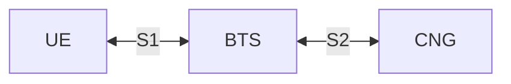

# The S2 Interfaces (Layer 1)

Responsibilities of this layer:
- Define the communication protocols between the UE and BTS, and between the BTS and CNG.
- Handle the transmission of data between the UE and CNG via the BTS nodes.
- UE session tracking within the BTS nodes, to ensure that data is correctly routed to the appropriate UE as sent to the BTS from the CNG.
- Attachment and detachment of UEs to the network, excluding authentication and Layer 2 security which are handled by the Layer 2 service and coordinated by the CNG.
- Packet state tracking and retransmission between the UE, BTS, and CNG to ensure reliable data transmission.
- Protect all UE-to-BTS packets after registration as a single encrypted value derived from the verification token issued by the CNG.

All packets are encoded as JSON serialized strings using `textutils.serializeJSON` and `textutils.unserializeJSON` functions.

## Part 1: Overview

### 1.1: Network Topology

The network consists of three main components:
- **User Equipment (UE)**: The end-user device, such as a computer or smartphone, that connects to the cellular network.
- **Base Transceiver Station (BTS)**: The intermediary node that facilitates communication between the UE and the CNG. Each BTS manages a specific coverage area, handles multiple UEs within that area, and announces connected UEs to the CNG.
- **Core Network Gateway (CNG)**: The central node that manages the overall network, including UE-to-BTS mapping, session management, verification token issuance, and routing of data between UEs and external networks.

There are two network interfaces:
- **S1 Interface**: Connects the UE to the BTS using the [Modem API](https://tweaked.cc/peripheral/modem.html).
- **S2 Interface**: Connects the BTS to the CNG using the [WebSocket API](https://tweaked.cc/module/http.html#v:websocket).

### 1.2: Common Packet Structure

All packets sent between the UE, BTS, and CNG will follow a common structure to ensure consistency and ease of parsing. The general structure of a packet is as follows:

| **Field name** | **Type** | **Description** |
|---|---:|---|
| `type` | string | Packet type identifier. |
| `sequenceNumber` | number | Incremental sequence number for tracking packet order and retransmissions. Responses should include the same sequence number as the original request.
| `timestamp` | number | UNIX timestamp when the packet was created; used for latency and timeout tracking.
| `payload` | object | Packet-specific data object; structure depends on `type`.

S1 uses two packet encodings:
- Initial registration packets are sent as plain JSON using the common packet structure above, because the UE does not yet have a verification token.
- After registration, every UE-to-BTS packet is serialized as JSON using the same logical structure, then encrypted and protected as a single opaque value using the verification token issued in `Attachment_Accept`. The BTS validates this protected value and derives the UE identity from the verified token.

S2 packets remain plain JSON because the BTS is already trusted by the CNG.

### 1.1: Common Data Types

#### UE Session State

| **Field name** | **Type** | **Description** |
|---|---:|---|
| `ueId` | number | UE identifier. |
| `state` | string | Session state, `"Attached"`, `"Idle"`, `"Detached"`. |
| `btsId` | number | Serving BTS identifier. |

## Part 2: S1 Interface (UE-BTS)

**Transport Layer**: [Modem API](https://tweaked.cc/peripheral/modem.html)

The S1 interface will make use of 40 modem channels, with channels `45001-45020` reserved for UE-to-BTS communication and channels `46001-46020` reserved for BTS-to-UE communication. This separation allows for full-duplex communication between the UE and BTS without channel contention. Each BTS should be configured to listen on a chosen 5 channels, to prevent conflicts within the respective ranges for uplink and downlink communication with UEs.

### 2.1: Towards UE (from BTS)

Packet types:
- [**`Data_Downlink`**](#212-data_downlink-payload-structure)
- [**`Paging`**](#212-paging-payload-structure)
- [**`BTS_Announcement`**](#213-bts_announcement-payload-structure)
- [**`Attachment_Accept`**](#214-attachment_accept-payload-structure)

#### 2.1.1: `Data_Downlink` payload structure

| **Field name** | **Type** | **Description** |
|---|---:|---|
| `service` | string | Layer 2 Service Identifier |
| `data` | string | Payload data encoded as a Base64 string for safe transmission over the modem. |

#### 2.1.2: `Paging` payload structure

| **Field name** | **Type** | **Description** |
|---|---:|---|
| (none) | null | This payload is `null` - there are no fields for `Paging`. |

#### 2.1.3: `BTS_Announcement` payload structure

| **Field name** | **Type** | **Description** |
|---|---:|---|
| `txChannels` | array<number> | Array of modem channels the BTS is transmitting on. |
| `rxChannels` | array<number> | Array of modem channels the BTS is receiving on. |
| `distance` | number | Estimated distance from the UE to this BTS in blocks. |

#### 2.1.4: `Attachment_Accept` payload structure

| **Field name** | **Type** | **Description** |
|---|---:|---|
| `verificationToken` | string | Verification token issued by the CNG for the UE to include in Layer 2 data links. |
| `expiresAt` | number | UNIX timestamp when the verification token expires. |

### 2.2: Towards BTS (from UE)

Packet types:
- [**`Data_Uplink`**](#221-data_uplink-payload-structure)
- [**`Attachment`**](#222-attachment-payload-structure)
- [**`Detachment`**](#223-detachment-payload-structure)
- [**`Paging_Response`**](#224-paging_response-payload-structure)

#### 2.2.1: `Data_Uplink` payload structure

| **Field name** | **Type** | **Description** |
|---|---:|---|
| `service` | string | Layer 2 Service Identifier |
| `data` | string | Payload data encoded as a Base64 string for safe transmission over the modem. |

#### 2.2.2: `Attachment` payload structure

| **Field name** | **Type** | **Description** |
|---|---:|---|
| (none) | null | This payload is `null` - there are no fields for `Attachment`. |

#### 2.2.3: `Detachment` payload structure

| **Field name** | **Type** | **Description** |
|---|---:|---|
| (none) | null | This payload is `null` - there are no fields for `Detachment`. |

#### 2.2.4: `Paging_Response` payload structure

| **Field name** | **Type** | **Description** |
|---|---:|---|
| (none) | null | This payload is `null` - there are no fields for `Paging_Response`. |
