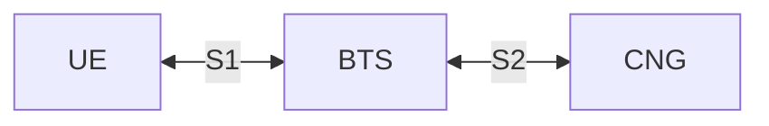

# The S2 Interfaces (Layer 1)

## Part 1: Overview

### 1.1: Network Topology

The network consists of three main components:
- **User Equipment (UE)**: The end-user device, such as a computer or smartphone, that connects to the cellular network.
- **Base Transceiver Station (BTS)**: The intermediary node that facilitates communication between the UE and the CNG. Each BTS manages a specific coverage area, handles multiple UEs within that area, and announces connected UEs to the CNG.
- **Core Network Gateway (CNG)**: The central node that manages the overall network, including UE-to-BTS mapping, session management, verification token issuance, and routing of data between UEs and external networks.

There are two network interfaces:
- **S1 Interface**: Connects the UE to the BTS using the [Modem API](https://tweaked.cc/peripheral/modem.html).
- **S2 Interface**: Connects the BTS to the CNG using the [WebSocket API](https://tweaked.cc/module/http.html#v:websocket).

### 1.2: Common Packet Structure

All packets sent between the UE, BTS, and CNG will follow a common structure to ensure consistency and ease of parsing. The general structure of a packet is as follows:

| **Field name** | **Type** | **Description** |
|---|---:|---|
| `type` | string | Packet type identifier. |
| `sequenceNumber` | number | Incremental sequence number for tracking packet order and retransmissions. Responses should include the same sequence number as the original request.
| `timestamp` | number | UNIX timestamp when the packet was created; used for latency and timeout tracking.
| `payload` | object | Packet-specific data object; structure depends on `type`.

S1 uses two packet encodings:
- Initial registration packets are sent as plain JSON using the common packet structure above, because the UE does not yet have a verification token.
- After registration, every UE-to-BTS packet is serialized as JSON using the same logical structure, then encrypted and protected as a single opaque value using the verification token issued in `Attachment_Accept`. The BTS validates this protected value and derives the UE identity from the verified token.

S2 packets remain plain JSON because the BTS is already trusted by the CNG.

### 1.1: Common Data Types

#### UE Session State

| **Field name** | **Type** | **Description** |
|---|---:|---|
| `ueId` | number | UE identifier. |
| `state` | string | Session state, `"Attached"`, `"Idle"`, `"Detached"`. |
| `btsId` | number | Serving BTS identifier. |

## Part 3: S2 Interface (BTS-CNG)

**Transport Layer**: [WebSocket API](https://tweaked.cc/module/http.html#v:websocket)

### 3.1: Towards BTS (from CNG)

Packet types:
- [**`Data_Downlink`**](#311-data_downlink-payload-structure)
- [**`Attachment_Result`**](#312-attachment_result-payload-structure)

#### 3.1.1: `Data_Downlink` payload structure

| **Field name** | **Type** | **Description** |
|---|---:|---|
| `service` | string | Layer 2 Service Identifier |
| `data` | string | Payload data encoded as a Base64 string for safe transmission over the WebSocket. |

#### 3.1.2: `Attachment_Result` payload structure

| **Field name** | **Type** | **Description** |
|---|---:|---|
| `ueId` | number | UE identifier. |
| `accepted` | boolean | Indicates whether the CNG accepted the UE on this BTS. |
| `verificationToken` | string\|null | Verification token for the UE to use when encrypting and protecting all later UE-to-BTS packets and Layer 2 data links when `accepted` is `true`. |
| `expiresAt` | number\|null | UNIX timestamp when the verification token expires. |

### 3.2: Towards CNG (from BTS)

Packet types:
- [**`Data_Uplink`**](#321-data_uplink-payload-structure)
- [**`Session_Update`**](#322-session_update-payload-structure)

#### 3.2.1: `Data_Uplink` payload structure

| **Field name** | **Type** | **Description** |
|---|---:|---|
| `service` | string | Layer 2 Service Identifier |
| `data` | string | Payload data encoded as a Base64 string for safe transmission over the WebSocket. |

#### 3.2.2: `Session_Update` payload structure

| **Field name** | **Type** | **Description** |
|---|---:|---|
| `ueId` | number | UE identifier. |
| `state` | string | Session state, `"Attached"`, `"Idle"`, `"Detached"`. |
| `btsId` | number | BTS currently serving the UE. |
