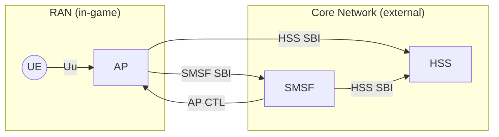

# CC: Tweaked Cellular Network Architecture

## 1: Overview

## 2: Network Topology

```mermaid
flowchart LR
    subgraph "RAN (in-game)"
        direction LR
        UE((UE))
        AP[AP]

        UE --> |"Uu"| AP
    end

    subgraph "Core Network (external)"
        direction TB
        HSS[HSS]
        SMSF[SMSF]
    end

    AP --> |"HSS SBI"| HSS
    AP --> |"SMSF SBI"| SMSF
    

    SMSF --> |"HSS SBI"| HSS
    SMSF --> |"AP CTL"| AP
```

## 3. HTTP SBIs

HTTP SBIs are used throughout the core network