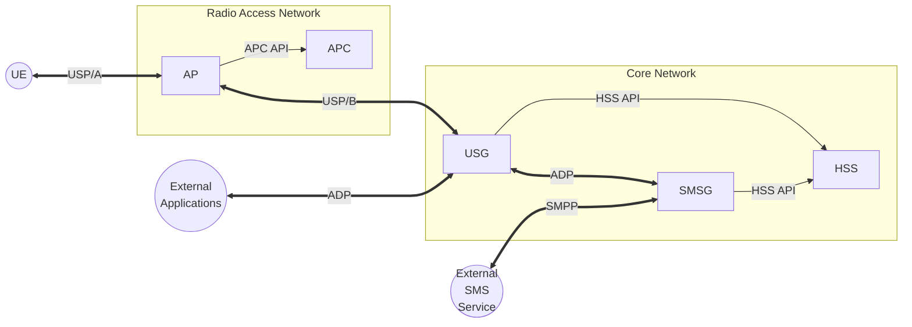

# CC: Tweaked Cellular Network Architecture

## 1: Aims and Objectives

The architecture of the CC: Tweaked cellular network is designed to provide a robust and scalable framework for in-game communication. The primary objectives of this architecture are:

1. **Modularity**: To allow for easy integration of new components and services without disrupting existing functionality.
2. **Scalability**: To support a growing number of users and devices without degradation in performance.
3. **Interoperability**: To ensure seamless communication between different components of the network, both in-game and external.
4. **Standardisation**: Use of existing protocols where possible to facilitate interoperability and extensibility.

There are objectives which are outside the scope of this architecture, such as:
- **Bulletproof security**: While security is a consideration, the architecture does not aim to provide comprehensive security measures against all potential threats.
- **Extensive custom protocol development**: The architecture focuses on using existing protocols where possible, and only developing custom protocols when necessary for specific use cases.
- **Full 3GPP feature support**: The architecture is designed to provide basic cellular network functionality, but does not aim to be 3GPP compliant or implement all features of modern cellular standards.

## 2: Network Topology

## 3. Network Components

| Component | Location | Description | Implementation |
|-----------|----------|-------------|----------------|
| **UE (User Equipment)** | In-Game+External | The in-game device that connects to the cellular network. It can be a computer, pocket computer, or a turtle. | Custom [../services/ue/](../services/ue/) |
| **AP (Access Point)** | In-Game+Internal | The in-game component that provides wireless connectivity to the UE. It acts as a bridge between the UE and the core network. | Custom [../services/ap/](../services/ap/) |
| **APC (Access Point Controller)** | Outside-Game+Internal | Facilitates remote configuration and management of APs, allowing for dynamic network adjustments and optimisations. | Custom |
| **USG (User Session Gateway)** | Outside-Game+Internal | Terminates user sessions and routes user traffic. Also maintains the application dictionary. | Custom |
| **HSS (Home Subscriber Server)** | Outside-Game+Internal | Stores subscriber information and authentication data. | Custom |
| **SMSG (Short Message Service Gateway)** | Outside-Game+Internal | Offloads all SMS processing to an upstream SMS service. | Custom |
| **External Applications** | Outside-Game | Third-party applications that interact with the cellular network, such as web services or SMS applications. | N/A |
| **External SMS Service** | Outside-Game | An external service that is responsible for the delivery of SMS messages. | N/A |

## 4. Communication Protocols

| Protocol | Description | Transport Layer |
|----------|-------------|-----------------|
| **USP/A (User Session Protocol / Profile A)** | Performs radio link establishment and tunnels application packets. | CC:T's Modem API |
| **USP/B (User Session Protocol / Profile B)** | Facilitates UE authentication and tunneling of application packets into the core network. | JSON over CC:T WebSockets |
| **ADP (Application Data Protocol)** | Routes application packets to serving application servers. | JSON over HTTP |
| **APC API** | Provides remote configuration and management capabilities for APs. | JSON over HTTP |
| **HSS API** | Allows the USG and SMSC to query subscriber information and authentication data from the HSS. | JSON over HTTP |
| **SMSC API** | Bridges the gap between external apps and SMSC, enabling the sending and receiving of SMS messages. | JSON over HTTP |
| **SMPP (Short Message Peer-to-Peer)** | A protocol used for exchanging SMS messages between the SMSG and external apps. | TCP/IP |
