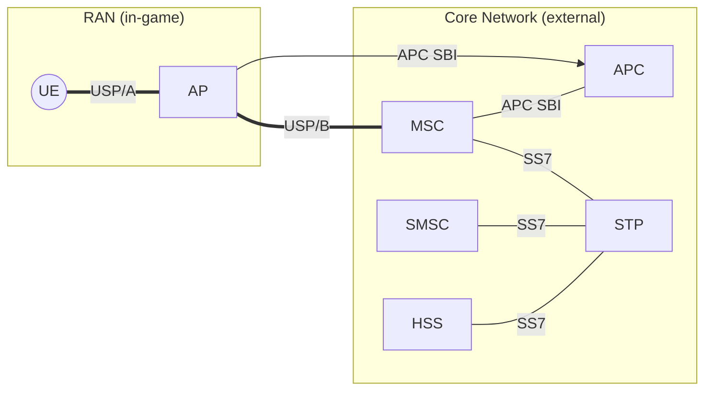

# CC: Tweaked Cellular Network Architecture

## 1: Aims and Objectives

The architecture of the CC: Tweaked cellular network is designed to provide a robust and scalable framework for in-game communication. The primary objectives of this architecture are:

1. **Modularity**: To allow for easy integration of new components and services without disrupting existing functionality.
2. **Scalability**: To support a growing number of users and devices without degradation in performance.
3. **Interoperability**: To ensure seamless communication between different components of the network, both in-game and external.
4. **Standardisation**: Use of existing protocols where possible to facilitate interoperability and extensibility.

What this does not aim to do is to replicate the full functionality of a real-world cellular network. Instead, it focuses on providing a simplified model that captures the essential features and interactions of a cellular network within the context of the game.

## 2: Network Topology

## 3. Network Components

| Component | Description | Implementation |
|-----------|-------------|----------------|
| **UE (User Equipment)** | The in-game device that connects to the cellular network. It can be a computer, pocket computer, or a turtle. | [../services/ue/](../services/ue/) |
| **AP (Access Point)** | The in-game component that provides wireless connectivity to the UE. It acts as a bridge between the UE and the core network. | [../services/ap/](../services/ap/) |
| **APC (Access Point Controller)** | Facilitates remote configuration and management of APs, allowing for dynamic network adjustments and optimisations. | ... |
| **MSC (Mobile Switching Center)** | Manages message setup, routing, and termination for the cellular network. | ... |
| **HSS (Home Subscriber Server)** | Manages subscriber information and authentication. | ... |
| **SMSC (Short Message Service Center)** | Handles the routing and delivery of SMS messages. | ... |
| **STP (Signalling Transfer Point)** | Routes signalling messages between components of the SS7 network. | [OsmoSTP](https://osmocom.org/projects/osmo-stp/wiki) |

## 4. Communication Protocols

| Protocol | Description | Transport Layer |
|----------|-------------|-----------------|
| **USP/A (User Session Protocol / Profile A)** | A custom protocol used to tunnel control and data traffic between the UE and AP. | CC:T's Modem API |
| **USP/B (User Session Protocol / Profile B)** | A custom protocol used to tunnel user data traffic between the AP and MSC. | JSON over CC:T WebSockets |
| **APC SBI (Service-Based Interface)** | Provides remote configuration and management capabilities for APs. | JSON over HTTP |
| **SS7 (Signalling System No. 7)** | A standard protocol used for signalling and control in telecommunication networks. | Standard SIGTRAN over SCTP/IP |
