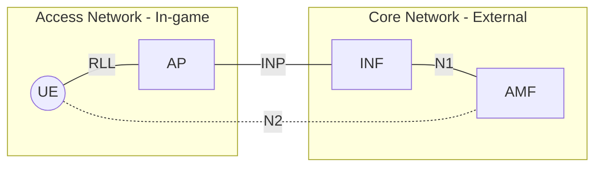

# CC Internetworking Tunnel

## 1. Introduction

The CC Internetworking Tunnel is a service designed for in-game CC UEs to reach the core network. It's a multi-stage relay combining rednet, WebSockets, and a custom protocol to provide a reliable and secure connection between the UE and the core network.

## 2. Network Topology

### 2.1. Network Components

The following components are involved in the CC Internetworking Tunnel:

| Component | Description |
|-----------|-------------|
| UE (User Equipment) | The User Equipment is the in-game client that initiates the connection to the core network. |
| AP (Access Point) | The Access Point is the in-game server that acts as a relay between the UE and the core network. |
| INF (Interworking Function) | The Interworking Function is the external server that bridges the in-game network with the core network. |
| AMF (Access and Mobility Management Function) | The Access and Mobility Management Function is the core network component that manages UE sessions and mobility. ***Note: This is not a real 3GPP AMF, but rather a specific CC Telecom implementation.*** |

### 2.2. Protocols

The CC Internetworking Tunnel uses the following protocols:

| Protocol | Description | Transport Layer |
|----------|-------------|-----------------|
| RLL (Rednet Link Layer) | The Rednet Link Layer is used by the UE to communicate with the AP over the in-game network. | Rednet |
| INP (Internetworking Protocol) | The Internetworking Protocol is a WebSocket-based protocol used for communication between the AP and the INF. | WebSocket |
| N1 (N1 Interface) | The N1 interface is used for communication between the INF and the AMF. | TCP |
| N2 (N2 Interface) | The N2 interface is the logical application layer connection between the UE and the AMF. | N/A |
