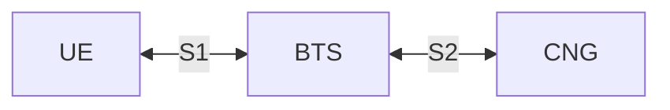
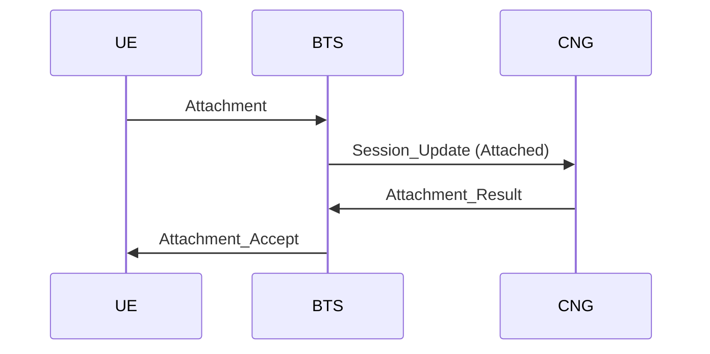
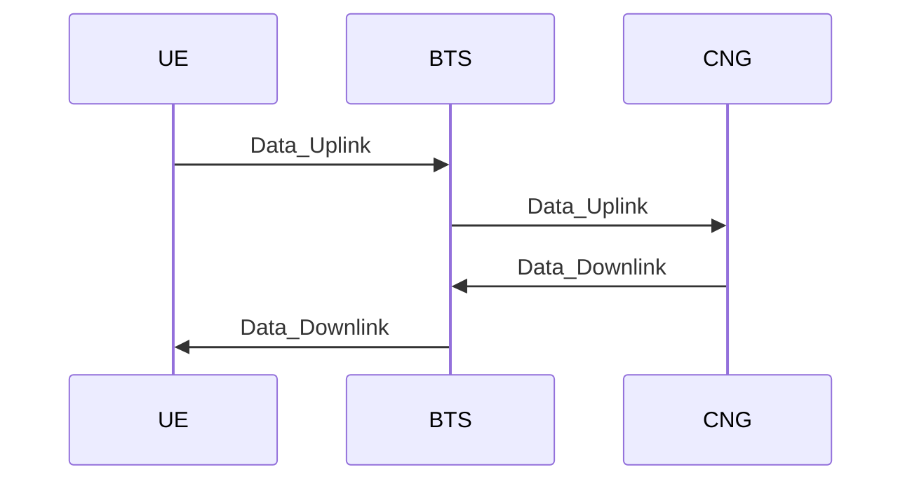

# The S1 and S2 Interfaces (Layer 1)

Responsibilities of this layer:
- Define the communication protocols between the UE and BTS, and between the BTS and CNG.
- Handle the transmission of data between the UE and CNG via the BTS nodes.
- UE session tracking within the BTS nodes, to ensure that data is correctly routed to the appropriate UE as sent to the BTS from the CNG.
- Attachment and detachment of UEs to the network, excluding authentication and Layer 2 security which are handled by the Layer 2 service and coordinated by the CNG.
- Packet state tracking and retransmission between the UE, BTS, and CNG to ensure reliable data transmission.
- Protect all UE-to-BTS packets after registration as a single encrypted value derived from the verification token issued by the CNG.

All packets are encoded as JSON serialized strings using `textutils.serializeJSON` and `textutils.unserializeJSON` functions.

## Part 1: Overview

### 1.1: Network Topology

The network consists of three main components:
- **User Equipment (UE)**: The end-user device, such as a computer or smartphone, that connects to the cellular network.
- **Base Transceiver Station (BTS)**: The intermediary node that facilitates communication between the UE and the CNG. Each BTS manages a specific coverage area, handles multiple UEs within that area, and announces connected UEs to the CNG.
- **Core Network Gateway (CNG)**: The central node that manages the overall network, including UE-to-BTS mapping, session management, verification token issuance, and routing of data between UEs and external networks.

There are two network interfaces:
- **S1 Interface**: Connects the UE to the BTS using the [Modem API](https://tweaked.cc/peripheral/modem.html).
- **S2 Interface**: Connects the BTS to the CNG using the [WebSocket API](https://tweaked.cc/module/http.html#v:websocket).

### 1.2: Common Packet Structure

All packets sent between the UE, BTS, and CNG will follow a common structure to ensure consistency and ease of parsing. The general structure of a packet is as follows:

| **Field name** | **Type** | **Description** |
|---|---:|---|
| `type` | string | Packet type identifier. |
| `sequenceNumber` | number | Incremental sequence number for tracking packet order and retransmissions. Responses should include the same sequence number as the original request.
| `timestamp` | number | UNIX timestamp when the packet was created; used for latency and timeout tracking.
| `payload` | object | Packet-specific data object; structure depends on `type`.

S1 uses two packet encodings:
- Initial registration packets are sent as plain JSON using the common packet structure above, because the UE does not yet have a verification token.
- After registration, every UE-to-BTS packet is serialized as JSON using the same logical structure, then encrypted and protected as a single opaque value using the verification token issued in `Attachment_Accept`. The BTS validates this protected value and derives the UE identity from the verified token.

S2 packets remain plain JSON because the BTS is already trusted by the CNG.

### 1.1: Common Data Types

#### UE Session State

| **Field name** | **Type** | **Description** |
|---|---:|---|
| `ueId` | number | UE identifier. |
| `state` | string | Session state, `"Attached"`, `"Idle"`, `"Detached"`. |
| `btsId` | number | Serving BTS identifier. |

## Part 2: S1 Interface (UE-BTS)

**Transport Layer**: [Modem API](https://tweaked.cc/peripheral/modem.html)

The S1 interface will make use of 40 modem channels, with channels `45001-45020` reserved for UE-to-BTS communication and channels `46001-46020` reserved for BTS-to-UE communication. This separation allows for full-duplex communication between the UE and BTS without channel contention. Each BTS should be configured to listen on a chosen 5 channels, to prevent conflicts within the respective ranges for uplink and downlink communication with UEs.

### 2.1: Towards UE (from BTS)

Packet types:
- [**`Data_Downlink`**](#212-data_downlink-payload-structure)
- [**`Paging`**](#212-paging-payload-structure)
- [**`BTS_Announcement`**](#213-bts_announcement-payload-structure)
- [**`Attachment_Accept`**](#214-attachment_accept-payload-structure)

#### 2.1.1: `Data_Downlink` payload structure

| **Field name** | **Type** | **Description** |
|---|---:|---|
| `service` | string | Layer 2 Service Identifier |
| `data` | string | Payload data encoded as a Base64 string for safe transmission over the modem. |

#### 2.1.2: `Paging` payload structure

| **Field name** | **Type** | **Description** |
|---|---:|---|
| (none) | null | This payload is `null` - there are no fields for `Paging`. |

#### 2.1.3: `BTS_Announcement` payload structure

| **Field name** | **Type** | **Description** |
|---|---:|---|
| `txChannels` | array<number> | Array of modem channels the BTS is transmitting on. |
| `rxChannels` | array<number> | Array of modem channels the BTS is receiving on. |
| `distance` | number | Estimated distance from the UE to this BTS in blocks. |

#### 2.1.4: `Attachment_Accept` payload structure

| **Field name** | **Type** | **Description** |
|---|---:|---|
| `verificationToken` | string | Verification token issued by the CNG for the UE to include in Layer 2 data links. |
| `expiresAt` | number | UNIX timestamp when the verification token expires. |

### 2.2: Towards BTS (from UE)

Packet types:
- [**`Data_Uplink`**](#221-data_uplink-payload-structure)
- [**`Attachment`**](#222-attachment-payload-structure)
- [**`Detachment`**](#223-detachment-payload-structure)
- [**`Paging_Response`**](#224-paging_response-payload-structure)

#### 2.2.1: `Data_Uplink` payload structure

| **Field name** | **Type** | **Description** |
|---|---:|---|
| `service` | string | Layer 2 Service Identifier |
| `data` | string | Payload data encoded as a Base64 string for safe transmission over the modem. |

#### 2.2.2: `Attachment` payload structure

| **Field name** | **Type** | **Description** |
|---|---:|---|
| (none) | null | This payload is `null` - there are no fields for `Attachment`. |

#### 2.2.3: `Detachment` payload structure

| **Field name** | **Type** | **Description** |
|---|---:|---|
| (none) | null | This payload is `null` - there are no fields for `Detachment`. |

#### 2.2.4: `Paging_Response` payload structure

| **Field name** | **Type** | **Description** |
|---|---:|---|
| (none) | null | This payload is `null` - there are no fields for `Paging_Response`. |

## Part 3: S2 Interface (BTS-CNG)

**Transport Layer**: [WebSocket API](https://tweaked.cc/module/http.html#v:websocket)

### 3.1: Towards BTS (from CNG)

Packet types:
- [**`Data_Downlink`**](#311-data_downlink-payload-structure)
- [**`Attachment_Result`**](#312-attachment_result-payload-structure)

#### 3.1.1: `Data_Downlink` payload structure

| **Field name** | **Type** | **Description** |
|---|---:|---|
| `service` | string | Layer 2 Service Identifier |
| `data` | string | Payload data encoded as a Base64 string for safe transmission over the WebSocket. |

#### 3.1.2: `Attachment_Result` payload structure

| **Field name** | **Type** | **Description** |
|---|---:|---|
| `ueId` | number | UE identifier. |
| `accepted` | boolean | Indicates whether the CNG accepted the UE on this BTS. |
| `verificationToken` | string\|null | Verification token for the UE to use when encrypting and protecting all later UE-to-BTS packets and Layer 2 data links when `accepted` is `true`. |
| `expiresAt` | number\|null | UNIX timestamp when the verification token expires. |

### 3.2: Towards CNG (from BTS)

Packet types:
- [**`Data_Uplink`**](#321-data_uplink-payload-structure)
- [**`Session_Update`**](#322-session_update-payload-structure)

#### 3.2.1: `Data_Uplink` payload structure

| **Field name** | **Type** | **Description** |
|---|---:|---|
| `service` | string | Layer 2 Service Identifier |
| `data` | string | Payload data encoded as a Base64 string for safe transmission over the WebSocket. |

#### 3.2.2: `Session_Update` payload structure

| **Field name** | **Type** | **Description** |
|---|---:|---|
| `ueId` | number | UE identifier. |
| `state` | string | Session state, `"Attached"`, `"Idle"`, `"Detached"`. |
| `btsId` | number | BTS currently serving the UE. |

## Part 4: UE Registration Procedure

The registration procedure establishes a UE session with the network. The UE listens for `BTS_Announcement` packets, selects the closest BTS, and attaches to it. Authentication is not part of Layer 1; instead, the CNG returns a verification token that the UE must use to encrypt and protect all later UE-to-BTS packets and Layer 2 data links.

This flow shows the UE registering with the network and receiving the verification token it must use to protect later UE-to-BTS packets and Layer 2 data links.

Explanation:
1. The UE listens for `BTS_Announcement` packets and chooses the closest BTS based on the announced `distance`.
2. The UE sends an unsigned `Attachment` to the selected BTS as the only UE-to-BTS packet allowed before token issuance.
3. The BTS notifies the CNG with `Session_Update (Attached)`, identifying the UE and the BTS serving it using BTS-local attachment state.
4. The CNG updates its UE-to-BTS mapping and decides whether to accept the attachment.
5. If accepted, the CNG returns `Attachment_Result` containing a verification token and expiry.
6. The BTS relays the token to the UE using `Attachment_Accept`.
7. If the CNG rejects the attachment, the BTS does not send `Attachment_Accept` and does not establish service.

### 4.1: Paging

Paging is used for the BTS to check if the UE is reachable when there is incoming data or calls for the UE while it is in idle mode.

The BTS will send a `Paging` message to the UE every 3 seconds. If the UE is reachable, it should respond with `Paging_Response`, protected using the current verification token. Upon receiving a valid `Paging_Response`, the BTS may keep the UE state alive and update the CNG with `Session_Update (Idle)` as needed.

Otherwise, if the UE does not respond to the `Paging` message, it would be assumed the UE has detached silently (e.g. due to moving out of coverage or powering off), and the BTS would update:
1. release its local state for the UE
2. send `Session_Update (Detached)` to reflect the UE's reachability.

### 4.2: Dangling Registration Handling

In some cases a UE might attach to a new BTS while still being registered at the old BTS (e.g. due to moving into a new coverage area without properly detaching from the old BTS).

To handle this, the CNG will prioritize the most recent attachment based on the order in which it receives `Session_Update` messages. If a new attachment is detected for a UE that is already attached elsewhere, the CNG will update the UE-to-BTS mapping to the new BTS and treat the old session as `Detached`. The old BTS will eventually age out or detach its local UE state through normal paging failure handling.

## Part 5: BTS Selection and Reattachment

Layer 1 does not support network-initiated handover. When the UE determines that a different BTS is now the closest one, it detaches from the current BTS and performs a fresh attachment to the closer BTS.

Explanation:
1. The UE continuously listens for `BTS_Announcement` packets while connected or idle.
2. If a different BTS becomes the closest option, the UE may send `Detachment` to the current BTS.
3. The UE sends `Attachment` to the new closest BTS.
4. The new BTS announces the UE to the CNG with `Session_Update (Attached)`.
5. The CNG updates the UE-to-BTS mapping and returns a fresh verification token for Layer 2 use.

## Part 6: Data Relay Procedure

This procedure describes data relay between UE and CNG through the BTS for both uplink and downlink traffic. Every Layer 2 uplink from the UE must be carried inside a UE-to-BTS packet that is encrypted and protected using the verification token issued during attachment.

Explanation:
1. The UE sends `Data_Uplink` to the serving BTS over the modem channel, encrypted and protected using the verification token received in `Attachment_Accept`.
2. The BTS validates and decrypts the protected packet, derives the UE identity from the verified token, and forwards `Data_Uplink` to the CNG over the WebSocket link.
3. The CNG uses its UE-to-BTS mapping to choose the correct BTS when there is data for the UE, then sends `Data_Downlink` to that BTS.
4. The BTS delivers `Data_Downlink` to the UE over the modem channel.
