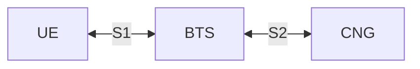
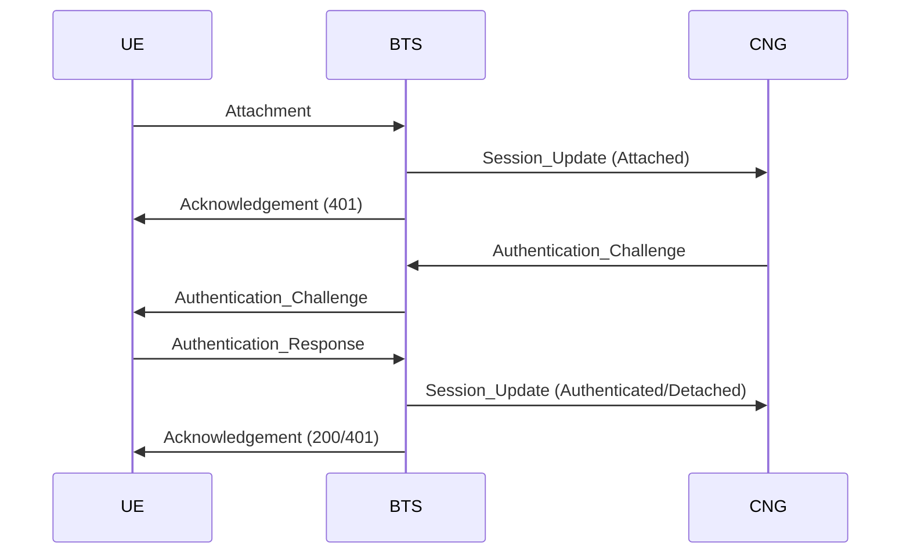
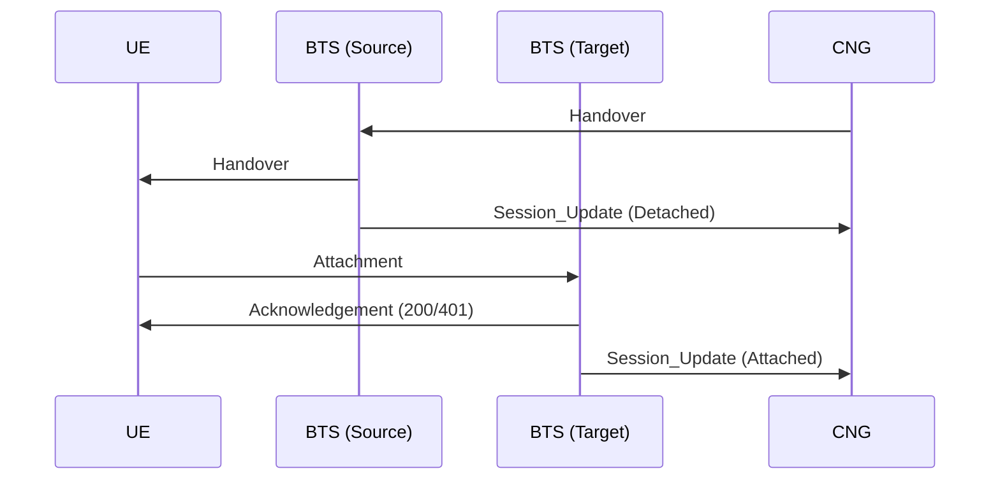
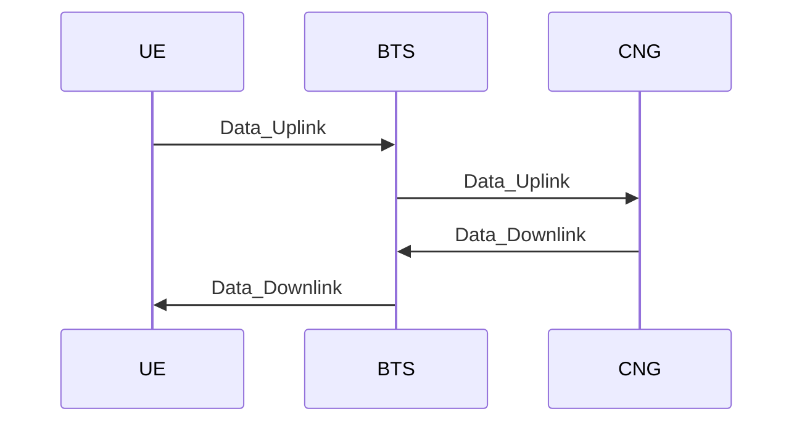

# Layer 1: UE-BTS <> BTS-CNG Protocol

Responsibilities of this layer:
- Define the communication protocols between the UE and BTS, and between the BTS and CNG.
- Handle the transmission of data between the UE and CNG via the BTS nodes.
- UE session tracking within the BTS nodes, to ensure that data is correctly routed to the appropriate UE as sent to the BTS from the CNG.
- Attachment and detachment of UEs to the network, excluding authentication, security, and mobility management which is handled by the CNG.
- Packet state tracking and retransmission between the UE, BTS, and CNG to ensure reliable data transmission.

All packets are encoded as JSON serialized strings using `textutils.serializeJSON` and `textutils.unserializeJSON` functions.

## Part 1: Overview

### 1.1: Network Topology

The network consists of three main components:
- **User Equipment (UE)**: The end-user device, such as a computer or smartphone, that connects to the cellular network.
- **Base Transceiver Station (BTS)**: The intermediary node that facilitates communication between the UE and the CNG. Each BTS manages a specific coverage area and handles multiple UEs within that area.
- **Core Network Gateway (CNG)**: The central node that manages the overall network, including authentication, session management, and routing of data between UEs and external networks.

There are two network interfaces:
- **S1 Interface**: Connects the UE to the BTS using the [Modem API](https://tweaked.cc/peripheral/modem.html).
- **S2 Interface**: Connects the BTS to the CNG using the [WebSocket API](https://tweaked.cc/module/http.html#v:websocket).

### 1.2: Common Packet Structure

All packets sent between the UE, BTS, and CNG will follow a common structure to ensure consistency and ease of parsing. The general structure of a packet is as follows:

| **Field name** | **Type** | **Description** |
|---|---:|---|
| `type` | string | Packet type identifier. |
| `sourceUE` | number\|null | ID of the source UE (as reported by `os.getComputerID()`), or `null` if the packet is from the BTS or CNG.
| `sequenceNumber` | number | Incremental sequence number for tracking packet order and retransmissions. Responses should include the same sequence number as the original request.
| `timestamp` | number | UNIX timestamp when the packet was created; used for latency and timeout tracking.
| `payload` | object | Packet-specific data object; structure depends on `type`.

### 1.1: Common Data Types

#### Acknowledgement Status Code

| **Status Code** | **Description** |
|-------------|-------------|
| `200`       | **Success**: The packet was received and processed successfully. |
| `400`       | **Bad Request**: The packet was malformed or missing required fields. |
| `401`       | **Unauthorized**: The UE is not authenticated to perform the requested action. |
| `404`       | **Invalid Service**: The specified data service is not recognized or supported. |
| `500`       | **Internal Server Error**: An error occurred while processing the packet. |

#### BTS Measurement Object

| **Field name** | **Type** | **Description** |
|---|---:|---|
| `btsId` | number | BTS identifier. |
| `distance` | number | Estimated distance to BTS in blocks. |

#### UE Session State

| **Field name** | **Type** | **Description** |
|---|---:|---|
| `ueId` | number | UE identifier. |
| `state` | string | Session state, `"Attached"`, `"Authenticated"`, `"Idle"`, `"Detached"`. |
| `lastSeen` | number | UNIX timestamp of the last-seen time for the UE. |
| `btsId` | number | Serving BTS identifier. |

## Part 2: S1 Interface (UE-BTS)

**Transport Layer**: [Modem API](https://tweaked.cc/peripheral/modem.html)

### 2.1: Towards UE (from BTS)

Packet types:
- [**`Acknowledgement`**](#211-acknowledgement-payload-structure)
- [**`Data_Downlink`**](#212-data_downlink-payload-structure)
- [**`Handover`**](#213-handover-payload-structure)
- [**`Paging`**](#214-paging-payload-structure)
- [**`BTS_Announcement`**](#215-bts_announcement-payload-structure)
- [**`Authentication_Challenge`**](#216-authentication_challenge-payload-structure)

#### 2.1.1: `Acknowledgement` payload structure

| **Field name** | **Type** | **Description** |
|---|---:|---|
| `statusCode` | [Acknowledgement Status Code](#acknowledgement-status-code) | Acknowledgement status code indicating the result of processing the original packet |

#### 2.1.2: `Data_Downlink` payload structure

| **Field name** | **Type** | **Description** |
|---|---:|---|
| `service` | string | Service type for the data, e.g. `"Internet"`, `"SMS"`, `"Voice_Call"`. |
| `data` | string | Payload data encoded as a Base64 string for safe transmission over the modem. |

#### 2.1.3: `Handover` payload structure

| **Field name** | **Type** | **Description** |
|---|---:|---|
| `targetBtsId` | number | ID of the BTS that the UE should hand over to. |
| `targetChannel` | number | Modem channel to use for the new BTS. |
| `handoverToken` | string | Short-lived token (Base64) for validating the handover at the target BTS. |
| `expiresAt` | number | UNIX timestamp when the handover token expires. |

#### 2.1.4: `Paging` payload structure

| **Field name** | **Type** | **Description** |
|---|---:|---|
| (none) | null | This payload is `null` - there are no fields for `Paging`. |

#### 2.1.5: `BTS_Announcement` payload structure

| **Field name** | **Type** | **Description** |
|---|---:|---|
| `btsId` | number | ID of the announcing BTS. |
| `channel` | number | Current operating modem channel for the BTS. |
| `load` | number | Load indicator from `0.0` to `1.0`. |

#### 2.1.6: `Authentication_Challenge` payload structure

| **Field name** | **Type** | **Description** |
|---|---:|---|
| `challengeId` | string | Unique challenge identifier. |
| `nonce` | string | Random nonce (Base64) for the UE to sign. |
| `algo` | string | Algorithm identifier, e.g. `HMAC-SHA256`. |
| `expiresAt` | number | UNIX timestamp when the challenge expires. |

### 2.2: Towards BTS (from UE)

Packet types:
- [**`Acknowledgement`**](#221-acknowledgement-payload-structure)
- [**`Data_Uplink`**](#222-data_uplink-payload-structure)
- [**`Attachment`**](#223-attachment-payload-structure)
- [**`Detachment`**](#224-detachment-payload-structure)
- [**`Measurement_Report`**](#225-measurement_report-payload-structure)
- [**`Authentication_Response`**](#226-authentication_response-payload-structure)

#### 2.2.1: `Acknowledgement` payload structure

| **Field name** | **Type** | **Description** |
|---|---:|---|
| `statusCode` | [Acknowledgement Status Code](#acknowledgement-status-code) | Acknowledgement status code indicating the result of processing the incoming packet. |

#### 2.2.2: `Data_Uplink` payload structure

| **Field name** | **Type** | **Description** |
|---|---:|---|
| `service` | string | Service type for the data, e.g. `"Internet"`, `"SMS"`, `"Voice_Call"`. |
| `data` | string | Payload data encoded as a Base64 string for safe transmission over the modem. |

#### 2.2.3: `Attachment` payload structure

| **Field name** | **Type** | **Description** |
|---|---:|---|
| `ismi` | string | UE identity (IMSI or temporary identity). |
| `handoverToken` | string\|null | Optional handover token (Base64) if attaching as part of a handover procedure. |

#### 2.2.4: `Detachment` payload structure

| **Field name** | **Type** | **Description** |
|---|---:|---|
| (none) | null | This payload is `null` - there are no fields for `Detachment`. |

#### 2.2.5: `Measurement_Report` payload structure

| **Field name** | **Type** | **Description** |
|---|---:|---|
| `measurements` | array<[BTS Measurement Object](#bts-measurement-object)> | Array of measurement objects |

#### 2.2.6: `Authentication_Response` payload structure

| **Field name** | **Type** | **Description** |
|---|---:|---|
| `challengeId` | string | Challenge identifier being responded to. |
| `mac` | string | HMAC value (Base64) of the challenge nonce and UE identity. |

## Part 3: S2 Interface (BTS-CNG)

**Transport Layer**: [WebSocket API](https://tweaked.cc/module/http.html#v:websocket)

### 3.1: Towards BTS (from CNG)

Packet types:
- [**`Data_Downlink`**](#311-data_downlink-payload-structure)
- [**`Handover`**](#312-handover-payload-structure)
- [**`Authentication_Challenge`**](#313-authentication_challenge-payload-structure)
- [**`Session_Query_Response`**](#314-session_query_response-payload-structure)

#### 3.1.1: `Data_Downlink` payload structure

| **Field name** | **Type** | **Description** |
|---|---:|---|
| `service` | string | Service type for the data, e.g. `"Internet"`, `"SMS"`, `"Voice_Call"`. |
| `data` | string | Payload data encoded as a Base64 string for safe transmission over the WebSocket. |

#### 3.1.2: `Handover` payload structure

| **Field name** | **Type** | **Description** |
|---|---:|---|
| `ueId` | number | UE identifier to hand over. |
| `targetBtsId` | number | ID of the BTS that the UE should hand over to. |
| `targetChannel` | number | Modem channel to use for the new BTS. |
| `handoverToken` | string | Short-lived token (Base64) for validating the handover at the target BTS. |
| `expiresAt` | number | UNIX timestamp when the handover token expires. |

#### 3.1.3: `Authentication_Challenge` payload structure

| **Field name** | **Type** | **Description** |
|---|---:|---|
| `ueId` | number | UE identifier being challenged. |
| `challengeId` | string | Unique challenge identifier. |
| `nonce` | string | Random nonce (Base64) for the UE to sign. |
| `algo` | string | Algorithm identifier, e.g. `HMAC-SHA256`. |
| `expiresAt` | number | UNIX timestamp when the challenge expires. |

#### 3.1.4: `Session_Query_Response` payload structure

| **Field name** | **Type** | **Description** |
|---|---:|---|
| ... | ...[UE Session State](#ue-session-state) | The session state object for the queried UE. |

### 3.2: Towards CNG (from BTS)

Packet types:
- [**`Data_Uplink`**](#321-data_uplink-payload-structure)
- [**`Session_Update`**](#322-session_update-payload-structure)
- [**`Session_Query`**](#323-session_query-payload-structure)
- [**`Measurement_Report`**](#324-measurement_report-payload-structure)

#### 3.2.1: `Data_Uplink` payload structure

| **Field name** | **Type** | **Description** |
|---|---:|---|
| `service` | string | Service type for the data, e.g. `"Internet"`, `"SMS"`, `"Voice_Call"`. |
| `data` | string | Payload data encoded as a Base64 string for safe transmission over the WebSocket. |

#### 3.2.2: `Session_Update` payload structure

| **Field name** | **Type** | **Description** |
|---|---:|---|
| `ueId` | number | UE identifier. |
| `state` | string | Session state, `"Attached"`, `"Authenticated"`, `"Idle"`, `"Detached"`. |
| `lastSeen` | number | UNIX timestamp of the last-seen time for the UE. |

#### 3.2.3: `Session_Query` payload structure

| **Field name** | **Type** | **Description** |
|---|---:|---|
| `ueId` | number | UE identifier. |

#### 3.2.4: `Measurement_Report` payload structure

| **Field name** | **Type** | **Description** |
|---|---:|---|
| `ueId` | number | UE identifier. |
| `measurements` | array<[BTS Measurement Object](#bts-measurement-object)> | Array of measurement objects |

## Part 4: UE Registration Procedure

The registration procedure establishes a UE session with the network. Authentication occurs during registration using the challenge-response exchange, but the security fields remain outside the packet envelope.

This flow shows the UE registering with the network, including the required authentication exchange.

Explanation:
1. The UE sends `Attachment` to begin or resume service with the serving BTS.
2. The BTS notifies the CNG with `Session_Update (Attached)` so the core can validate the UE.
3. The BTS responds to the UE with `Acknowledgement (401)` to indicate that authentication is required.
4. The CNG issues an `Authentication_Challenge` to the BTS, which the BTS relays to the UE.
5. The UE replies with `Authentication_Response`, proving possession of the shared secret.
6. The BTS confirms success to the CNG using `Session_Update (Authenticated)`, or failure with `Session_Update (Detached)` if authentication fails.
7. The BTS sends an `Acknowledgement` to the UE: status `200` on successful authentication, or `401` if authentication fails.

### 4.1: Paging

Paging is used for the BTS to check if the UE is reachable when there is incoming data or calls for the UE while it is in idle mode.

The BTS will send a `Paging` message to the UE every 3 seconds, and the UE should respond with an `Acknowledgement (200)` if it is reachable and ready to receive data. If the UE responds successfully, the BTS can then update the CNG with a `Session_Update (Idle)` to indicate the UE is now active and can receive data.

Otherwise, if the UE does not respond to the `Paging` message, it would be assumed the UE has detached silently (e.g. due to moving out of coverage or powering off), and the BTS would update:
1. first confirm if the UE attached elsewhere by sending a `Session_Query` to the CNG 
2. if not, then update with a `Session_Update (Detached)` to reflect the UE's reachability.

### 4.2: Dangling Registration Handling

In some cases a UE might attach to a new BTS while still being registered at the old BTS (e.g. due to moving into a new coverage area without properly detaching from the old BTS).

To handle this, the CNG will prioritize the most recent attachment based on the `lastSeen` timestamp in the `Session_Update` messages. If a new attachment is detected for a UE that is already attached elsewhere, the CNG will mark the old session as `Detached` and update the new session as `Attached`. The old BTS will be notified of the detachment via a `Session_Query_Response (Detached)` message, prompting it to release resources for that UE.

## Part 5: Handover Procedure

This procedure shows a network-initiated handover. The CNG instructs the source BTS, the UE reattaches to the target BTS using the handover token, and session state is updated at the CNG.

Explanation:
1. The CNG decides a handover is required and sends `Handover` to the source BTS.
2. The source BTS forwards `Handover` to the UE with the target BTS ID, channel, token, and expiry.
3. The source BTS updates the CNG with `Session_Update (Detached)` to indicate the UE is detaching from the source BTS.
4. The UE initiates `Attachment` to the target BTS, including the handover token for validation.
5. The target BTS responds to the UE with `Acknowledgement (200)` if the handover is successful, or `Acknowledgement (401)` if the token is invalid or expired.
6. The target BTS updates the CNG with `Session_Update (Attached)` to indicate the UE is now attached to the target BTS.

## Part 6: Data Relay Procedure

This procedure describes data relay between UE and CNG through the BTS for both uplink and downlink traffic.

Explanation:
1. The UE sends `Data_Uplink` to the serving BTS over the modem channel.
2. The BTS forwards `Data_Uplink` to the CNG over the WebSocket link.
3. The CNG sends `Data_Downlink` to the BTS when there is data for the UE.
4. The BTS delivers `Data_Downlink` to the UE over the modem channel.
