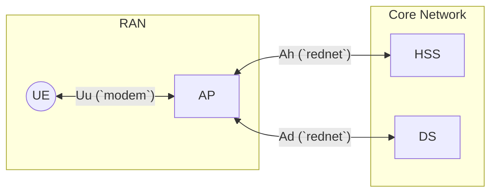

# CC: Tweaked Cellular Access Network Specification

## 1: Scope

**In Scope**:
- Defining the architecture and components of a cellular access network for CC: Tweaked
- Specifying the interfaces and protocols used for communication between components
- Outlining the security considerations for the network
- Defining protocols and procedures for authentication, authorisation, and data transmission

**Out of Scope**: 
- Real-world cellular network standards (e.g., 4G, 5G) and their specific implementations
- Implementations of specific Data Services (DS) beyond the general interface and requirements
- Implementation of a common transport layer abstraction

## 2: Terminology

| Term | Description |
|---------|-------------|
| **Radio Access Network (RAN)** | Used for wireless communication between User Equipment and the core network |
| **Core Network** | Serves as the central hub for managing and routing data within the radio data network |
| **Data Network** | The overall grouping of network infrastructure that facilitates access to Data Services |
| **Access Point (AP)** | Allows UEs to bind to the network, enforce network policies through the HSS, and serves as a gateway for data transmission |
| **User Equipment (UE)** | Connects to the network to provide access to Data Services |
| **Home Subscriber Server (HSS)** | Tracks UE mobility information, manages authentication and authorization, and maintains a registry of Data Services |
| **Data Service (DS)** | Implements a service assessable over the data network |

## 3: Network Architecture

1. The RAN consists of UEs and APs, where UEs connect to the network through APs using the Uu interface.
2. The AP serves as a gateway between the RAN and the Core Network, facilitating communication.
3. The AP communicates with the HSS using the Ah interface for authentication, authorization, and mobility management, while it uses the Ad interface to transmit data to and from the DS.
4. The Core Network includes the HSS, which manages subscriber information and authentication, and the DS.

## 4: Transport and Trust

| Interface | Trust level | Transport | Responsibilities |
|-----------|-------------|-----------|------------------|
| **Uu** | Untrusted | `modem` | Provides wireless connectivity for UEs to access the network |
| **Ah** | Trusted | `rednet` | Facilitates communication between the AP and HSS for authentication, authorization, and mobility management |
| **Ad** | Trusted | `rednet` | Enables data transmission between the AP and Data Services, allowing UEs to access various services over the network |
| **Dh** | Trusted | `rednet` | Facilitates registration of Data Services towards the HSS and allows a DS to query the HSS for subscriber information |

Trusted networks SHOULD make use of secure mediums like physical network cables instead of transporting over-the-air.

## 5: Uu Interface

### 5.1: Message Formats

### 5.2: State Machines

#### 5.2.1: UE State Machine

#### 5.2.2: AP State Machine

## 6: Ah Interface

### 6.1: Message Formats

### 6.2: State Machines

#### 6.2.1: AP State Machine

#### 6.2.2: HSS State Machine

## 7: Ad Interface

### 7.1: Message Formats

### 7.2: State Machines

#### 7.2.1: AP State Machine

#### 7.2.2: DS State Machine

## 8: Dh Interface

### 8.1: Message Formats

### 8.2: State Machines

#### 8.2.1: DS State Machine

#### 8.2.2: HSS State Machine
